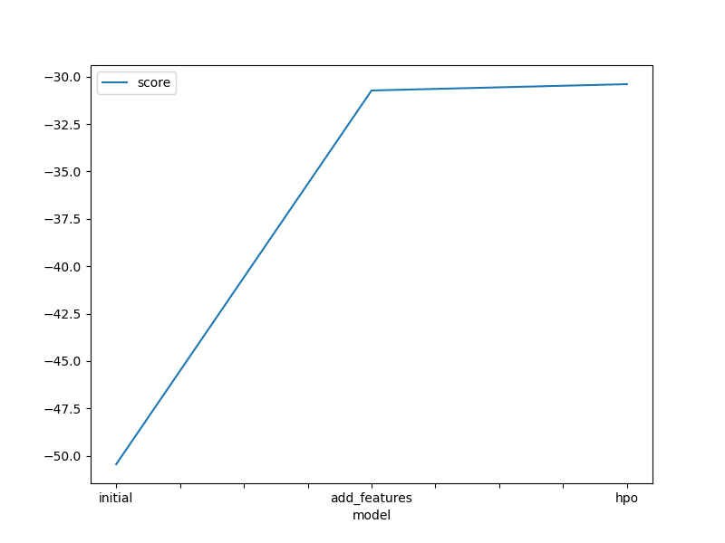
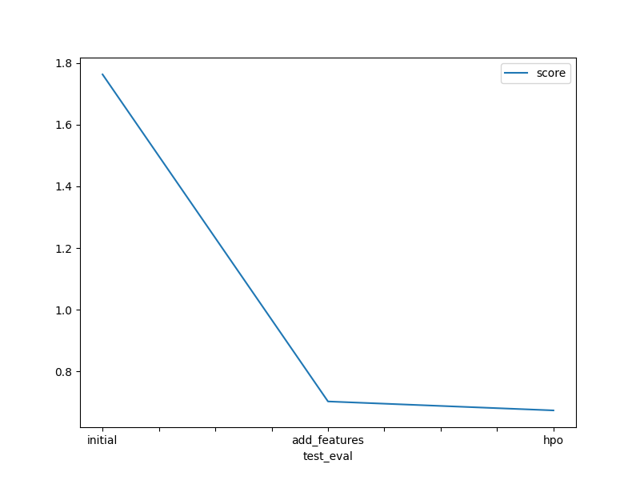

# Report: Predict Bike Sharing Demand with AutoGluon Solution
#### Mika Mauser

## Initial Training
### What did you realize when you tried to submit your predictions? What changes were needed to the output of the predictor to submit your results?
For me it actually worked right away to submit my predictions. If there were negative values I would have to convert them to zeros first because Kaggle doesn't take submissions with negative values.

### What was the top ranked model that performed?
The Weighted Ensemble model worked the best for me in each of the 3 models. And the best overall score got the hyperparameter optimized model with a score of 0.674.

## Exploratory data analysis and feature creation
### What did the exploratory analysis find and how did you add additional features?
I found that it might be important to split the datetime into separate columns: month, day and hour. This is also how I added additional features.
Also it is important for the Autogluon framework to have data with the correct data types. Therefore, I changed the types of the "weather" and "season" columns to categories.

### How much better did your model preform after adding additional features and why do you think that is?
It cause a huge improvement, jumping from a score of 1.763 to 0.703. The cause of this is probably that the models can learn to separate the dates better, for example it might be easier to learn that during specific hours (such as rush hour in the morning) the demand for bikes is higher than usual.

## Hyper parameter tuning
### How much better did your model preform after trying different hyper parameters?
At first it even got worse and jumped back to a score of ~0.8. After iterating a couple of times I finally got it to perform better than without doing hyperparameter optimization and my best attempt was 0.674. Then I've tried to adjust the hyperparameters for specific models (changed learning_rate and n_estimations for the best performing models) and the score spiked up to 1.45.

### If you were given more time with this dataset, where do you think you would spend more time?
I would try to spend more time figuring out which model mostly performs the best and try to train Autogluon with just the best performing models and tune the hyperparameters further. Also, I would try to engineer new features such as categorizing the humidity in different levels etc.

### Create a table with the models you ran, the hyperparameters modified, and the kaggle score.
|model|time_limit|presets|added hyperparams|score|
|--|--|--|--|--|
|initial|600|best_quality|None|1.763|
|add_features|600|best_quality|None|0.703|
|hpo|900|best_quality|num_bag_folds=5, num_stack_levels=5, num_bag_sets=10|0.674|

### Create a line plot showing the top model score for the three (or more) training runs during the project.

### Create a line plot showing the top kaggle score for the three (or more) prediction submissions during the project.

## Summary
Throughout this notebook I've learned to utilize EDA to engineer features, clean up the dataset and improve the quality of the data to improve the training of the models. I've also learned how to use the Autogluon framework to easily train models with engineered data and predict test data with the trained model aswell. I also saw how to do hyperparameter optimization and experiment and iterate on different parameters to find a model that works better for the given task. Furthermore, I saw how to visualize the model scores in plots and through them, show the improvement of the trained models. 
